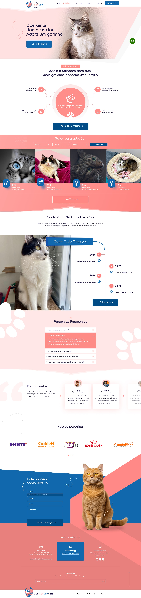

# Frontend Ong de gatinho   [](https://app.netlify.com/sites/demokbrtec/deploys)


> Linha adicional de texto informativo sobre o que o projeto faz. Sua introdução deve ter cerca de 2 ou 3 linhas. Não exagere, as pessoas não vão ler.

### 📝 Ajustes e melhorias

O projeto ainda está em desenvolvimento e as próximas atualizações serão voltadas nas seguintes tarefas:

- [ ] Componentizar elementos mais basicos  
- [x] Otimizar imagens com tiny-png 
- [ ] Ajustar Responsividade 
- [ ] melhorar SEO com google-Page-speed 
- [x] fazer deploy no Netlify 

## 💻 Pré-requisitos

Antes de começar, verifique se você atendeu aos seguintes requisitos:

- Você instalou a versão mais recente de `Nodejs/docker`
- Você tem uma máquina `<Windows / Linux / Mac>`
- Você leu `<guia / link / documentação_relacionada_ao_projeto>`.

## 🚀 Instalando Ong de gatinho 

Para instalar o Ong de gatinho , siga estas etapas:

Linux, macOS Windows:

```bash
git clone https://github.com/hellyaxs/projeto-KBRTEC.git && cd projeto-KBRTEC
```

```bash
npm install
```

docker:

```bash
docker build -t app:latest . 
```

## ☕ [link para demo](https://demokbrtec.netlify.app/ "netlify link")

<div style="height: 400px; overflow: scroll; border: 1px solid gray;">
  
</div>

Para usar Ong de gatinho, siga estas etapas:

usando Nodejs

```bash
npm run dev
# or
yarn dev
# or
pnpm dev
# or
bun dev
```

docker:

```bash
docker compose up -d
```

## [☕ link para demo](https://demokbrtec.netlify.app/)


Adicione comandos de execução e exemplos que você acha que os usuários acharão úteis. Fornece uma referência de opções para pontos de bônus!

## 📫 Contribuindo 

Para contribuir com o projeto, siga estas etapas:

1. Bifurque este repositório.
2. Crie um branch: `git checkout -b <nome_branch>`.
3. Faça suas alterações e confirme-as: `git commit -m '<mensagem_commit>'`
4. Envie para o branch original: `git push origin <nome_do_projeto> / <local>`
5. Crie a solicitação de pull.

Como alternativa, consulte a documentação do GitHub em [como criar uma solicitação pull](https://help.github.com/en/github/collaborating-with-issues-and-pull-requests/creating-a-pull-request).
